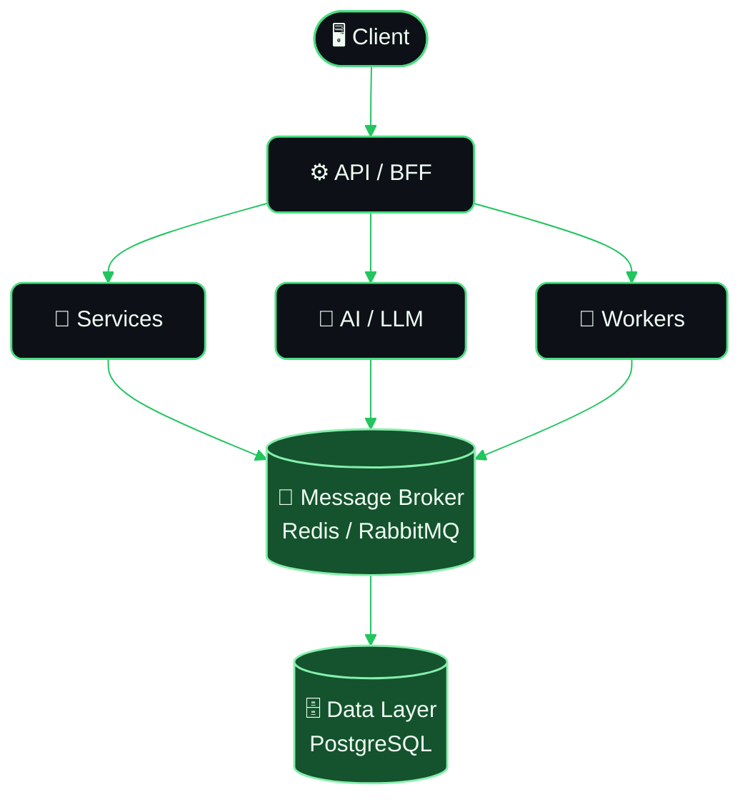
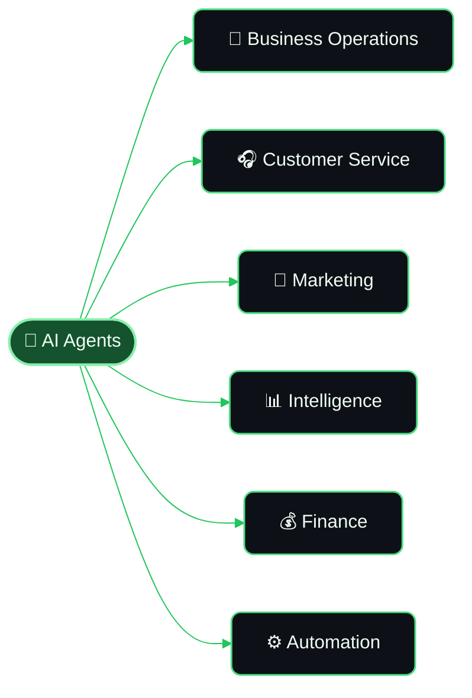

<!-- ======================= HEADER ======================= -->
<p align="center">
  
</p>

<p align="center">
  
</p>

<p align="center">
  <a href="https://github.com/xdevgabriel">
    
  </a>
  <a href="https://www.linkedin.com/in/gabriel-alves-ab8349244/">
    
  </a>
</p>

<p align="center">
  <a href="#-sobre-mim">Sobre</a> •
  <a href="#-foco-de-engenharia">Foco</a> •
  <a href="#%EF%B8%8F-arquitetura">Arquitetura</a> •
  <a href="#-nanohub">NanoHub</a> •
  <a href="#-stack-tecnológica">Stack</a> •
  <a href="#-estatísticas">Stats</a>
</p>

<br>

<!-- ======================= ABOUT ======================= -->
<h2 align="center">👨‍💻 Sobre mim</h2>

<p align="center">
  Engenheiro de Software focado em <strong>sistemas backend, arquiteturas distribuídas,<br>
  automação e soluções com IA.</strong>
</p>

<p align="center">
  Gosto de transformar requisitos de negócio complexos em software
  <strong>confiável, escalável e fácil de manter</strong> — e de simplificar o que puder ser simplificado.
</p>

<br>
<p align="center">
  
</p>

<br>

<!-- ======================= ENGINEERING FOCUS ======================= -->
<h2 align="center">🚀 Foco de Engenharia</h2>

<table align="center" width="100%">
<tr>
<td width="50%" valign="top">

### 🔧 Backend Engineering
- APIs REST e serviços de alta performance
- Autenticação & autorização
- Processamento assíncrono
- Lógica de negócio complexa
- Microsserviços & integrações

</td>
<td width="50%" valign="top">

### 🔄 Sistemas Distribuídos
- Filas de mensagens (Redis, RabbitMQ)
- Workers e processamento em background
- Arquitetura orientada a eventos
- Celery
- Workflows tolerantes a falha

</td>
</tr>
<tr>
<td width="50%" valign="top">

### 🤖 IA & Automação
- Aplicações com LLMs
- Agentes de IA & tool calling
- Workflows inteligentes
- Automação de processos
- LangChain

</td>
<td width="50%" valign="top">

### ☁️ Infraestrutura
- Docker & Linux
- Nginx & reverse proxies
- Deploys containerizados
- Cloud infrastructure
- CI/CD

</td>
</tr>
</table>

<br>

<!-- ======================= ARCHITECTURE ======================= -->
<h2 align="center">🏗️ Arquitetura</h2>

<p align="center">Como penso a construção de sistemas — do client à camada de dados:</p>



<br>

<!-- ======================= WHAT I BUILD ======================= -->
<h2 align="center">💡 O que eu construo</h2>

<table align="center" width="100%">
<tr>
<td width="50%" valign="top">

**🧠 Sistemas com IA**
Software inteligente capaz de raciocinar, usar ferramentas e executar workflows automatizados.

**⚙️ Plataformas Backend**
APIs, serviços e arquiteturas desenhadas para confiabilidade, manutenibilidade e escala.

</td>
<td width="50%" valign="top">

**🔁 Infraestrutura de Automação**
Sistemas que transformam processos repetitivos em workflows automatizados.

**📡 Sistemas Distribuídos**
Workers, filas e arquiteturas assíncronas para processar grandes volumes de dados.

</td>
</tr>
</table>

<br>

<!-- ======================= CURRENT PROJECT ======================= -->
<h2 align="center">🚀 NanoHub</h2>

<p align="center">
  <strong>Infraestrutura de negócios autônoma, potencializada por IA.</strong>
</p>

<p align="center">
  O NanoHub é desenhado em torno de capacidades de IA especializadas que atuam em diferentes<br>
  áreas de uma empresa, combinando automação, inteligência e operações em um só sistema.
</p>



<p align="center">
  
  
  
  
  
</p>

<br>

<!-- ======================= PRINCIPLES ======================= -->
<h2 align="center">🧩 Princípios de Engenharia</h2>

```text
01. Simplicidade antes da complexidade.
02. Arquitetura explícita, sem abstração desnecessária.
03. Automatizar o que for repetitivo.
04. Projetar para a falha, não só para o sucesso.
05. Observabilidade faz parte da arquitetura.
06. Software deve evoluir sem se tornar frágil.
07. Performance importa, mas confiabilidade vem primeiro.
```

<br>

<!-- ======================= TECH STACK ======================= -->
<h2 align="center">💻 Stack Tecnológica</h2>

<p align="center"></p>

<p align="center">


<br>


<br>


<br>


</p>

<br>


<h3 align="center">🐍 Gráfico de Contribuições</h3>

<p align="center">
  <picture>
    <source media="(prefers-color-scheme: dark)" srcset="https://raw.githubusercontent.com/xdevgabriel/xdevgabriel/output/github-snake-dark.svg" />
    <source media="(prefers-color-scheme: light)" srcset="https://raw.githubusercontent.com/xdevgabriel/xdevgabriel/output/github-snake.svg" />
    
  </picture>
</p>

<br>

<!-- ======================= FOOTER ======================= -->
<p align="center">
  
</p>

<p align="center">
  <strong>Building systems. Automating processes. Solving complex problems.</strong>
</p>

<p align="center">
  <code>gabriel@github:~$ ./build_future.sh</code>
</p>
