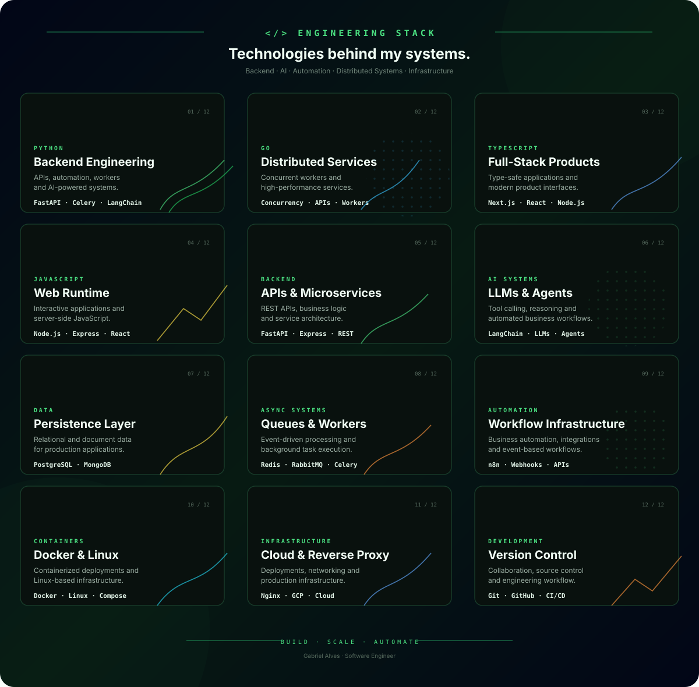

<!-- ======================= HEADER ======================= -->

<p align="center">
  
</p>

<p align="center">
  
</p>

<p align="center">
  <a href="https://github.com/xdevgabriel">
    
  </a>
  <a href="https://www.linkedin.com/in/gabriel-alves-ab8349244/">
    
  </a>
</p>

<br>

<!-- ======================= ABOUT ======================= -->

<h2 align="center">👨‍💻 About Me</h2>

<p align="center">
  Software Engineer focused on building <strong>backend systems, distributed architectures,
  automation platforms and AI-powered solutions.</strong>
</p>

<p align="center">
  I enjoy transforming complex business requirements into
  <strong>reliable, scalable and maintainable software.</strong>
</p>

<br>

<!-- ======================= TERMINAL ======================= -->

<h3 align="center">⚡ Engineering Profile</h3>

<p align="center">
  
</p>

<br>


<br>
<!-- ======================= ENGINEERING FOCUS ======================= -->

<h2 align="center">🚀 Engineering Focus</h2>

<table align="center">
<tr>
<td width="50%" valign="top">

### Backend Engineering

* REST APIs
* High-performance services
* Authentication & authorization
* Async processing
* Business logic
* Microservices
* API integrations

</td>

<td width="50%" valign="top">

### Distributed Systems

* Message queues
* Background workers
* Event-driven architecture
* Redis
* RabbitMQ
* Celery
* Fault-tolerant workflows

</td>
</tr>

<tr>
<td width="50%" valign="top">

### AI & Automation

* LLM applications
* AI agents
* Tool calling
* Intelligent workflows
* Process automation
* AI-powered SaaS
* LangChain

</td>

<td width="50%" valign="top">

### Infrastructure

* Docker
* Linux
* Nginx
* Cloud infrastructure
* Reverse proxies
* Containerized deployments
* CI/CD

</td>
</tr>
</table>

<br>

<!-- ======================= ARCHITECTURE ======================= -->

<h2 align="center">🏗️ Architecture Mindset</h2>

```text
                    ┌─────────────────┐
                    │     CLIENT      │
                    └────────┬────────┘
                             │
                             ▼
                    ┌─────────────────┐
                    │    API / BFF    │
                    └────────┬────────┘
                             │
              ┌──────────────┼──────────────┐
              │              │              │
              ▼              ▼              ▼
        ┌──────────┐   ┌──────────┐   ┌──────────┐
        │ Services │   │ AI / LLM │   │ Workers  │
        └────┬─────┘   └────┬─────┘   └────┬─────┘
             │              │              │
             └──────────────┼──────────────┘
                            │
                            ▼
                   ┌─────────────────┐
                   │ Message Broker  │
                   │ Redis / Rabbit  │
                   └────────┬────────┘
                            │
                            ▼
                   ┌─────────────────┐
                   │   Data Layer    │
                   │ PostgreSQL / DB │
                   └─────────────────┘
```

<br>

<!-- ======================= PROJECTS ======================= -->

<h2 align="center">💡 What I Build</h2>

<p align="center">

<strong>AI-Powered Systems</strong><br>
Intelligent software capable of reasoning, interacting with tools and executing automated workflows.

<br><br>

<strong>Backend Platforms</strong><br>
APIs, services and architectures designed around reliability, maintainability and scalability.

<br><br>

<strong>Automation Infrastructure</strong><br>
Systems that transform repetitive business processes into automated workflows.

<br><br>

<strong>Distributed Systems</strong><br>
Workers, queues and asynchronous architectures for processing workloads at scale.

</p>

<br>

<!-- ======================= CURRENT PROJECT ======================= -->

<h2 align="center">🚀 Current Projects</h2>

<h3>🧠 NanoHub</h3>

<p>
An autonomous business infrastructure powered by AI.
</p>

<p>
NanoHub is designed around specialized AI capabilities that can operate across different areas of a company, combining automation, intelligence and operational workflows.
</p>

```text
AI Agents
    │
    ├── Business Operations
    ├── Customer Service
    ├── Marketing
    ├── Intelligence
    ├── Finance
    └── Automation
```

<p>
<strong>Focus:</strong>
<code>AI</code>
<code>Automation</code>
<code>SaaS</code>
<code>Backend</code>
<code>Distributed Systems</code>
</p>

<br>

<!-- ======================= PRINCIPLES ======================= -->

<h2 align="center">🧩 Engineering Principles</h2>

```text
01. Simplicity before complexity.
02. Explicit architecture over unnecessary abstraction.
03. Automate repetitive operations.
04. Design for failure, not only success.
05. Observability is part of the architecture.
06. Software should evolve without becoming fragile.
07. Performance matters, but reliability comes first.
```

<br>

<!-- ======================= GITHUB ACTIVITY ======================= -->

<h2 align="center">📊 GitHub Activity</h2>

<p align="center">
  
</p>

<br>

<!-- ======================= GITHUB STATS ======================= -->

<h2 align="center">📈 GitHub Statistics</h2>

<p align="center">
  


</p>

<br>

<!-- ======================= STREAK ======================= -->

<p align="center">
  
</p>

<br>

<!-- ======================= CONTRIBUTION SNAKE ======================= -->

<h2 align="center">🐍 Contribution Graph</h2>

<p align="center">

<picture>
  <source
    media="(prefers-color-scheme: dark)"
    srcset="https://raw.githubusercontent.com/xdevgabriel/xdevgabriel/output/github-snake-dark.svg"
  />

<source
 media="(prefers-color-scheme: light)"
 srcset="https://raw.githubusercontent.com/xdevgabriel/xdevgabriel/output/github-snake.svg"
/>

 </picture>

</p>

<br>

<!-- ======================= LANGUAGES ======================= -->

<h2 align="center">💻 Languages & Technologies</h2>

<p align="center">


<br>


<br>


<br>


</p>

<br>

<!-- ======================= FOOTER ======================= -->

<p align="center">
  
</p>

<p align="center">
  <strong>Building systems. Automating processes. Solving complex problems.</strong>
</p>

<p align="center">
  <code>gabriel@github:~$ ./build_future.sh</code>
</p>
```
